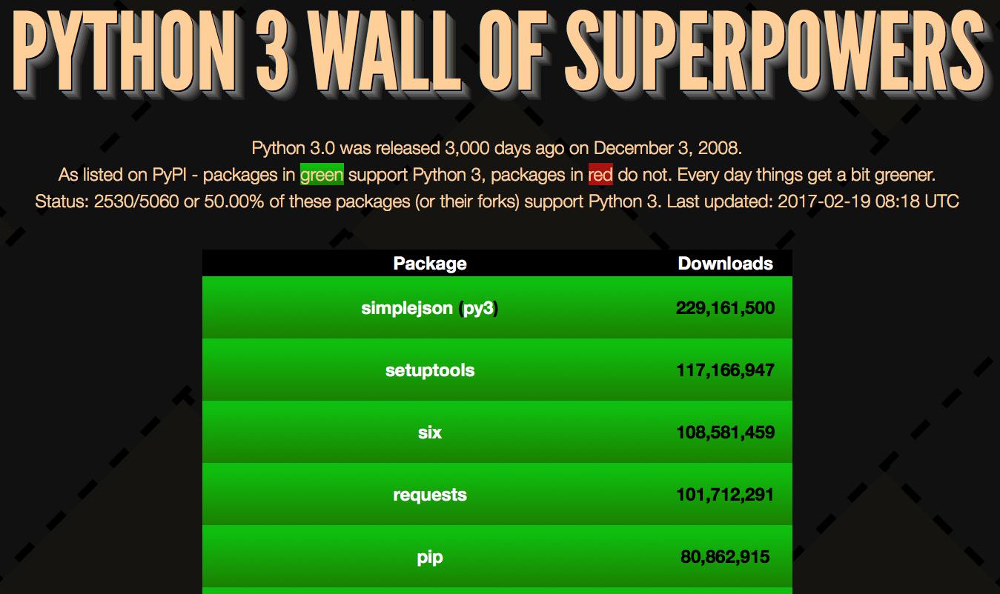

# Python 3 Wall of Superpowers

The code in this repo should be running on Bluemix at: http://python3wos.mybluemix.net (add /200 thru /90000 to the URL) or if you want your own instance, you can:

__90% of the top [423](https://python3wos.mybluemix.net/423) most downloaded [PyPI](http://pypi.python.org) packages (or their forks) support Python 3.__

__Half of the top [5,050](https://python3wos.mybluemix.net/5050) most downloaded PyPI packages (or their forks) support Python 3.__

__31.18% of ALL PyPI packages (or their forks) support Python 3. Last updated: 2017-02-18__

__Which of the top [5,000](http://python3wos.mybluemix.net/5000) most downloaded PyPI packages are Python 3 compatible?__

This is Python 3.5 or later version of https://github.com/ubershmekel/python3wos which adds `asyncio` in order to determine Python 3 support data by reading each package's `Programming Language :: Python :: [...]` [trove classifiers](https://pypi.python.org/pypi?%3Aaction=list_classifiers) from PyPI.  The use of asyncio substantially lowers the time required to gather data on 5,000 PyPI packages to about 20 seconds on [Bluemix](http://www.ibm.com/cloud-computing/bluemix/).  ALL PyPI packages take about 2 minutes to gather and process.  The asynchronous web server behind python3wos is powered by the `aiohttp` module.

[Top 200](http://python3wos.mybluemix.net/) is the default web page but dynamic web pages will be generated for any route between http://python3wos.mybluemix.net/0200 and http://python3wos.mybluemix.net/90000 so you can explore how Python 3 compatibility drops on as the list grows:
* [Top 200](http://python3wos.mybluemix.net/200), 
[Top 400](http://python3wos.mybluemix.net/400), 
[Top 600](http://python3wos.mybluemix.net/600), 
[Top 800](http://python3wos.mybluemix.net/800), 
[Top 1000](http://python3wos.mybluemix.net/1000), 
[Top 1200](http://python3wos.mybluemix.net/1200), 
[Top 1400](http://python3wos.mybluemix.net/1400),
[Top 1600](http://python3wos.mybluemix.net/1600), 
[Top 1800](http://python3wos.mybluemix.net/1800)
* [Top 2000](http://python3wos.mybluemix.net/2000), 
[Top 2200](http://python3wos.mybluemix.net/2200), 
[Top 2400](http://python3wos.mybluemix.net/2400), 
[Top 2600](http://python3wos.mybluemix.net/2600), 
[Top 2800](http://python3wos.mybluemix.net/2800), 
[Top 3000](http://python3wos.mybluemix.net/3000), 
[Top 3200](http://python3wos.mybluemix.net/3200), 
[Top 3400](http://python3wos.mybluemix.net/3400), 
[Top 3600](http://python3wos.mybluemix.net/3600)
* [Top 3800](http://python3wos.mybluemix.net/3800).
[Top 4000](http://python3wos.mybluemix.net/4000), 
[Top 4200](http://python3wos.mybluemix.net/4200), 
[Top 4400](http://python3wos.mybluemix.net/4400), 
[Top 4600](http://python3wos.mybluemix.net/4600), 
[Top 4800](http://python3wos.mybluemix.net/4800), 
[Top 5000](http://python3wos.mybluemix.net/5000).
* < 50% Python 3 compatible ;-(  [Top 5200](http://python3wos.mybluemix.net/5200).

