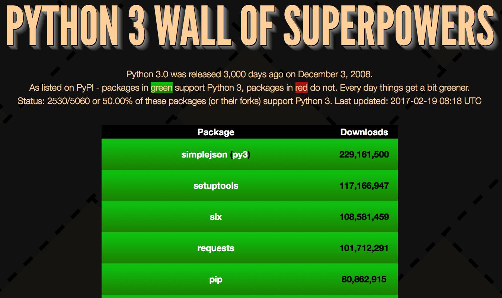

# Python 3 Wall of Superpowers

The code in this repo should be running on Bluemix at: http://python3wos.mybluemix.net (add /500 thru /100000 to the URL) or if you want your own instance, you can:

__90% of the top [501](https://python3wos.mybluemix.net/501) most downloaded [PyPI](http://pypi.python.org) packages (or their forks) support Python 3.__

__Half of the top [5,436](https://python3wos.mybluemix.net/5436) most downloaded PyPI packages (or their forks) support Python 3.__

__31.20% of ALL PyPI packages (or their forks) support Python 3. Last updated: 2017-04-19__

__Which of the top [5,000](http://python3wos.mybluemix.net/5000) most downloaded PyPI packages are Python 3 compatible?__

This is Python 3.5 or later version of https://github.com/ubershmekel/python3wos which adds `asyncio` in order to determine Python 3 support data by reading each package's `Programming Language :: Python :: [...]` [trove classifiers](https://pypi.python.org/pypi?%3Aaction=list_classifiers) from PyPI.  The use of asyncio substantially lowers the time required to gather data on 5,000 PyPI packages to about 20 seconds on [Bluemix](http://www.ibm.com/cloud-computing/bluemix/).  ALL PyPI packages take about 2 minutes to gather and process.  The asynchronous web server behind python3wos is powered by the `aiohttp` module.

[Top 200](http://python3wos.mybluemix.net/) is the default web page but dynamic web pages will be generated for any route between http://python3wos.mybluemix.net/500 and http://python3wos.mybluemix.net/100000 so you can explore how Python 3 compatibility drops as the list grows:
* [Top 500](http://python3wos.mybluemix.net/500), 
[Top 1000](http://python3wos.mybluemix.net/1000), 
[Top 2000](http://python3wos.mybluemix.net/2000), 
[Top 3000](http://python3wos.mybluemix.net/3000), 
[Top 4000](http://python3wos.mybluemix.net/4000), 
[Top 5000](http://python3wos.mybluemix.net/5000).
* < 50% Python 3 compatible ;-(  [Top 6000](http://python3wos.mybluemix.net/6000).

